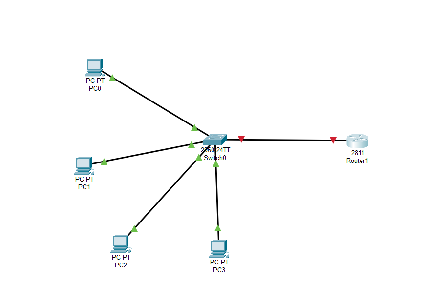
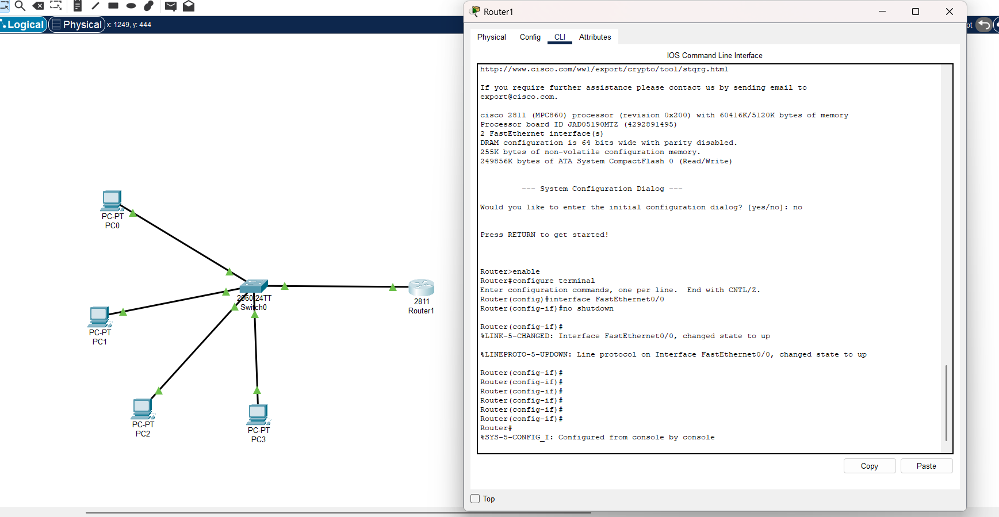
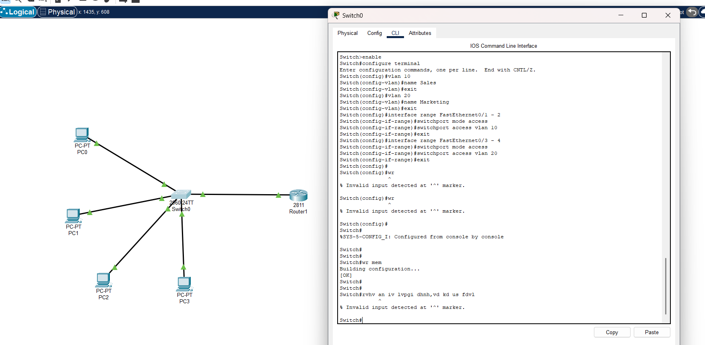
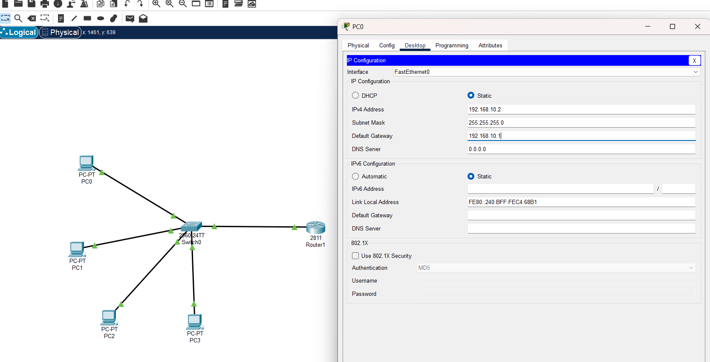
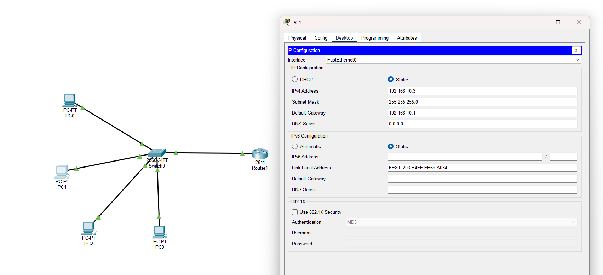
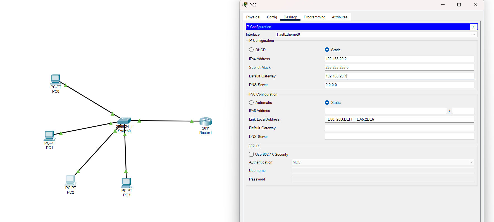
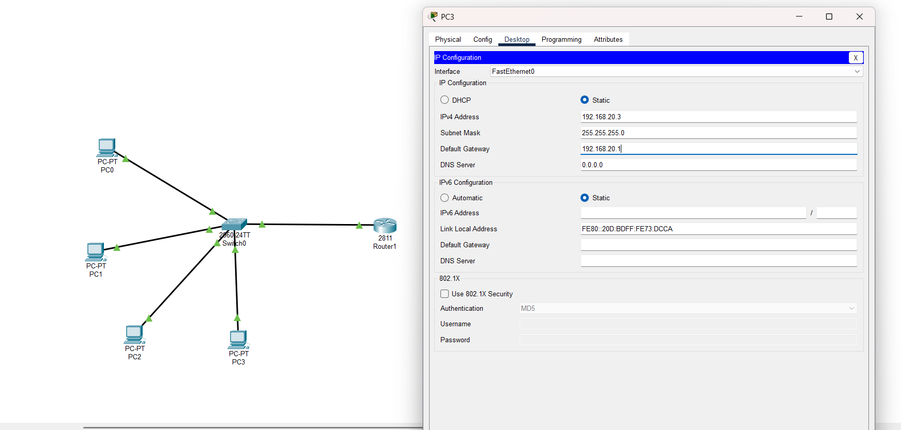
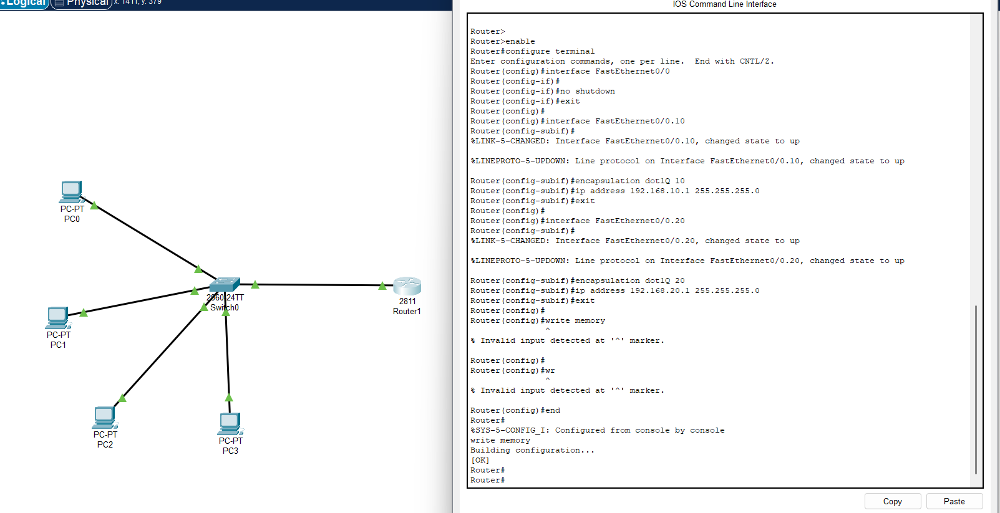
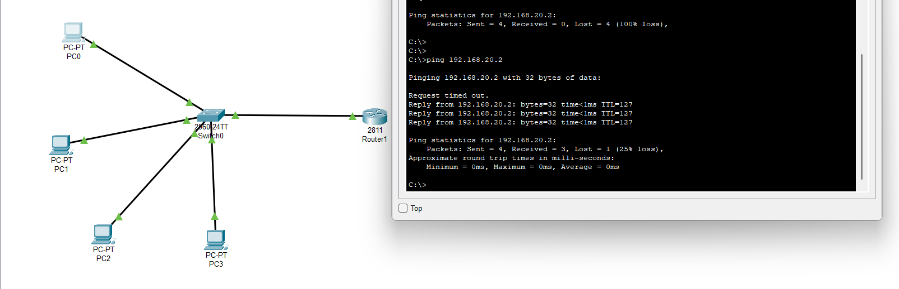
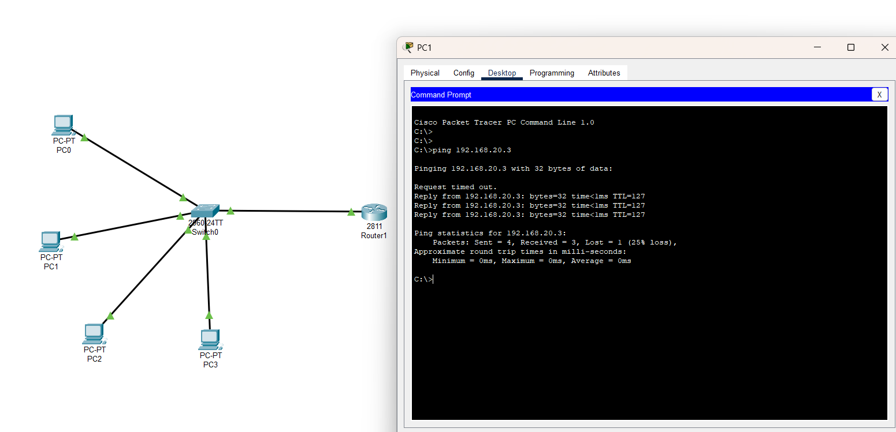

# VLAN Configuration Project in Cisco Packet Tracer

# Introduction

This project demonstrates the setup of a basic local area network (LAN) using Cisco Packet Tracer. The network includes a Cisco 2960-24TT switch connected to four PCs (PC0, PC1, PC2, PC3) and a Cisco 2811 Router1. The objective was to configure VLANs for network segmentation, assign static IP addresses to devices, set up router subinterfaces with dot1Q encapsulation for inter-VLAN routing, and test connectivity using ping commands. The project covers initial topology design, device configuration, and basic troubleshooting to ensure partial network functionality.

---
# Configuration Steps

## Step 1: Initial Network Topology Setup

This screenshot shows the initial network topology design. A Cisco 2960-24TT switch is connected to four PCs (PC0, PC1, PC2, PC3) and a Cisco 2811 Router1. The connections are established using Ethernet links, with the switch serving as the central device for PC connectivity and the router handling external routing. This step outlines the basic structure before any configuration is applied.

---

## Step 2: Initial Router Configuration

This screenshot displays the initial CLI configuration process for Router1 (Cisco 2811). The system configuration dialog is initiated, and the router's basic setup is started, including enabling the router and configuring the FastEthernet0/0 interface. The topology with the switch and PCs remains visible, indicating the context of this configuration step.

---
## Step 3: Initial Switch Configuration

This screenshot shows the initial CLI configuration of Switch0 (Cisco 2960-24TT). VLANs are being configured, with VLAN 10 named "Sales" and VLAN 20 named "Marketing." FastEthernet ports 0/1 to 0/2 are assigned to VLAN 10, and ports 0/3 to 0/4 are assigned to VLAN 20. The configuration process is in progress, with some invalid input errors noted.

---
## Step 4: IP Configuration for PCs

These screenshots display the IP configuration for each PC (PC0, PC1, PC2, PC3) with static IP settings:  
PC0: IP Address 192.168.10.2, Subnet Mask 255.255.255.0, Default Gateway 192.168.10.1  
PC1: IP Address 192.168.10.3, Subnet Mask 255.255.255.0, Default Gateway 192.168.10.1  
PC2: IP Address 192.168.10.4, Subnet Mask 255.255.255.0, Default Gateway 192.168.10.1  
PC3: IP Address 192.168.10.5, Subnet Mask 255.255.255.0, Default Gateway 192.168.10.1

---
## Step 5: Router Subinterface Configuration

This screenshot shows the CLI configuration of Router1 (Cisco 2811). Subinterfaces are configured with dot1Q encapsulation for VLANs 10 and 20:

FastEthernet0/0.10: Encapsulation dot1Q 10, IP Address 192.168.10.1, Subnet Mask 255.255.255.0

FastEthernet0/0.20: Encapsulation dot1Q 20, IP Address 192.168.20.1, Subnet Mask 255.255.255.0 The main FastEthernet0/0 interface is shut down, and the subinterfaces are brought up to support VLAN routing.

---
## Step 6: Network Connectivity Testing

These screenshots display ping tests from PCs to verify network connectivity:

From PC0 to PC2: Successful ping with 32 bytes, time < 1ms, 0% loss.

From PC1 to PC3: Successful ping with 32 bytes, time < 1ms, 0% loss.

 These tests confirm successful connectivity between the PCs within the network.

